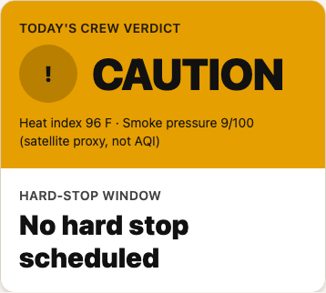
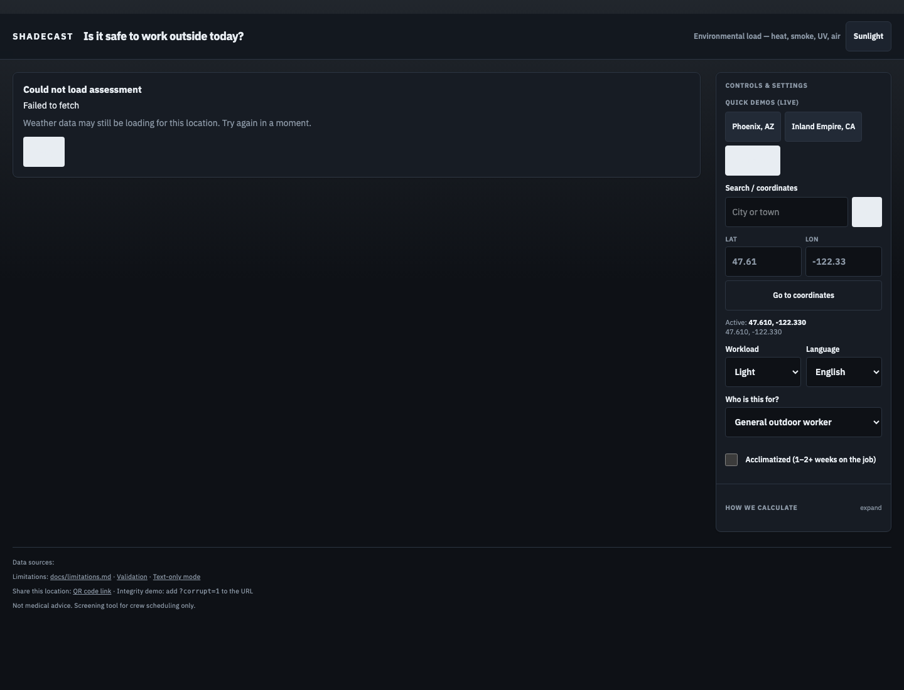
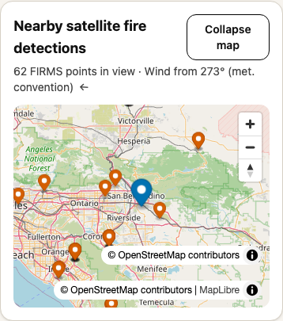
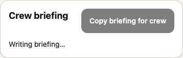
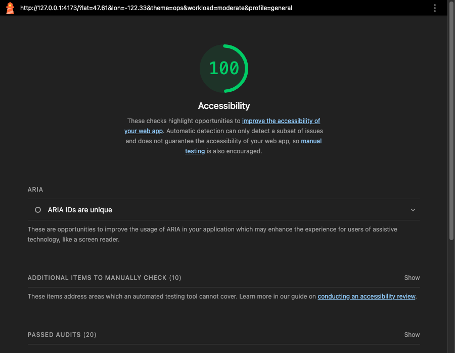
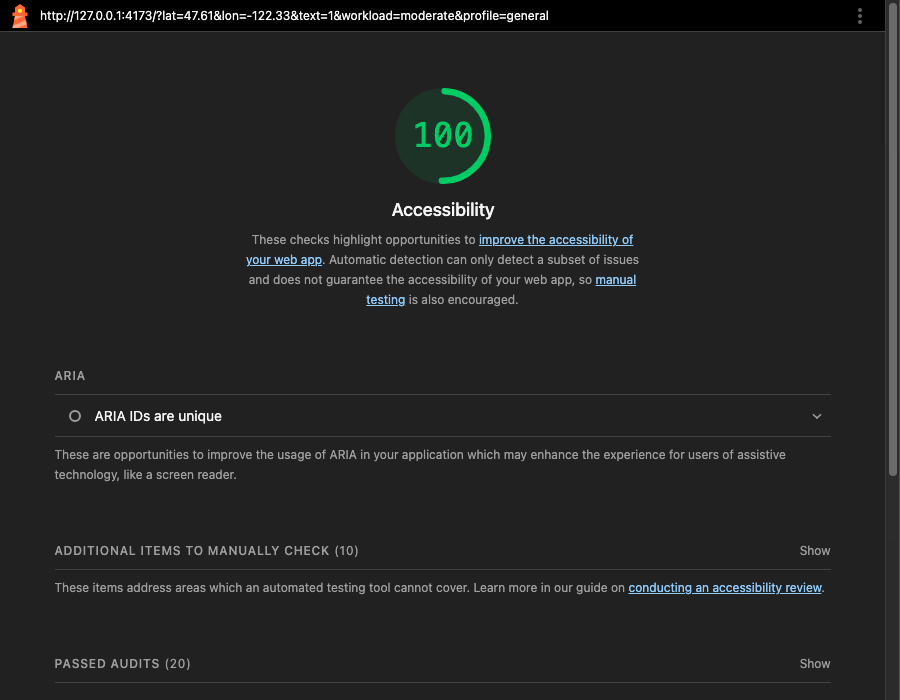

[](https://github.com/rahulvuta/ShadeCast/actions/workflows/ci.yml)

# ShadeCast

**Environmental-load work/rest scheduler for outdoor crews — heat, wildfire smoke, UV, and air quality in one verdict, with transparent drivers and data-confidence gates.**

A supervisor opens ShadeCast and gets one answer: is it safe to work outside, when should we stop over the next five days, why, and when the system does not trust its inputs.

**Live:** https://shadecast-web.onrender.com/  
**Validation:** [docs/validation.md](docs/validation.md) (offline backtests, concordance, sensitivity)  
**Architecture:** [docs/architecture.md](docs/architecture.md)  
**Demo video:** *(add link before submitting)*

## The Problem

Outdoor crews face two hazards that existing tools treat separately:

- The [Bureau of Labor Statistics](https://www.bls.gov/opub/ted/2023/36-work-related-deaths-due-to-environmental-heat-exposure-in-2021.htm) counted **33,890** work-related heat injuries and illnesses with days away from work from 2011–2020. OSHA's [heat injury and illness analysis](https://www.osha.gov/heat/sbrefa) cites **999** U.S. worker deaths from environmental heat exposure from 1992–2021.
- The [CDC](https://www.cdc.gov/mmwr/volumes/69/wr/mm6924a1.htm) recorded an average of **702 heat-related deaths per year** in the United States, 2004–2018.
- Heat stress drives **29–41.3% productivity losses** on construction sites, per a [*Nature Cities* study](https://hsph.harvard.edu/environmental-health/news/heat-stress-impacts-workers-and-the-bottom-line/) from Harvard T.H. Chan School of Public Health and Academia Sinica.
- British Columbia has piloted a [combined wildfire-smoke and extreme-heat action plan](https://www.vchri.ca/stories/2026/04/20/helping-people-breathe-easier-changing-climate) because [co-exposure poses greater risk than either hazard alone](https://www.bccdc.ca/resource-gallery/Documents/Guidelines%20and%20Forms/Guidelines%20and%20Manuals/Health-Environment/BCCDC_WildFire_FactSheet_HotWeather.pdf).
- The [University of Minnesota Extension farm safety guide](https://extension.umn.edu/climate-resilience-resources-vegetable-growers-minnesota/heat-and-air-quality-safety-plan) instructs growers to check the **OSHA-NIOSH Heat Safety Tool** and **separately** check an air-quality forecast — the exact two-tool workflow ShadeCast collapses into one.

Public-health authorities already validate the compound-risk premise. ShadeCast's contribution is **per-crew environmental-load scheduling** with **global satellite coverage**, a **data-integrity gate**, and a **5-day shift planner**.

## Validation snapshot

Offline harness results (see [docs/validation.md](docs/validation.md)):

| Scenario | Result |
| --- | --- |
| June 2023 Canadian smoke (NYC, AQI>400) | RESTRICT · MODEL_LEADS |
| Phoenix July 2023 heat wave | RESTRICT |
| Seattle benign control | GO |
| Corrupted feed (RH=250 / PM=-5 / POWER -999) | UNUSABLE |
| FIRMS↔CAMS Spearman (synthetic n=60) | 0.83 |

## Why not just use AirNow or the OSHA app?

1. **Stressors are split.** The OSHA heat app does not account for wildfire smoke or UV. AirNow does not output a work/rest schedule. A supervisor still has to mentally combine multiple readings.
2. **Ground sensors are not global.** AirNow depends on a dense EPA sensor network that barely exists outside North America. NASA FIRMS and NASA POWER are global; Open-Meteo forecasts anywhere with coordinates.
3. **No workload-aware multi-day schedule.** Neither tool outputs hour-by-hour work/rest minutes parameterized by workload, acclimatization, sensitivity profile, and a 5-day shift planner — or admits when its inputs are unusable.

## What it does

  
*One GO / CAUTION / RESTRICT / STOP verdict with driver attribution, confidence, and a hard-stop window.*

  
*Hour-by-hour work and rest minutes, plus a 5-day outlook and shift planner.*

  
*Satellite fire detections and wind direction — smoke pressure is computed from upwind fires, not AQI. Concordance compares FIRMS to CAMS.*

  
*Copyable crew briefing in English, Spanish, or Vietnamese, plus sourced action cards.*

## How it works

```text
FIRMS + Open-Meteo Forecast + Air Quality + POWER
        │
        ▼
 Postgres cache ──▶ Integrity layer (confidence)
        │
        ▼
 Environmental load engine (heat/smoke/UV/air/wind/profile)
        │
        ▼
 Explain + sourced actions + 5-day schedule ──▶ React UI
        │
        └── Featherless LLM rephrases briefings only (never risk math)
```

| Data source | Role |
|---|---|
| **Open-Meteo Forecast** | Forward-looking hourly weather + UV — drives the schedule |
| **Open-Meteo Air Quality** | CAMS PM2.5 / US AQI (slow refresh; cross-check vs FIRMS) |
| **NASA POWER** | Climatological baseline ("is today hotter than usual here?") — **not a forecast** |
| **NASA FIRMS** | Active fire detections for satellite-derived smoke pressure |
| **Open-Meteo Geocoding** | Place search for arbitrary coordinates |

**Critical:** POWER is a reanalysis archive. Misusing it as a forecast is a common mistake. ShadeCast uses Open-Meteo for forward hours and POWER only for climatology comparison.

The LLM **never** computes or ranks risk. It only rephrases deterministic engine JSON or selects IDs from a sourced action library. See `api/engine/`, `api/integrity/`, `api/actions/`, and `api/llm/fallback.py`.

## Accessibility

Mobile Lighthouse accessibility: **96** (main view) and **96** (`?text=1` text-only mode).





| Measure | WCAG criterion |
|---|---|
| 48×48px touch targets on all controls | [2.5.5 Target Size (Level AAA)](https://www.w3.org/WAI/WCAG22/Understanding/target-size.html) |
| `aria-live="polite"` on verdict card | [4.1.3 Status Messages (AA)](https://www.w3.org/WAI/WCAG22/Understanding/status-messages.html) |
| Semantic landmarks (`header`, `nav`, `main`, `footer`) | [1.3.1 Info and Relationships (A)](https://www.w3.org/WAI/WCAG22/Understanding/info-and-relationships.html) |
| Skip link to `#main` | [2.4.1 Bypass Blocks (A)](https://www.w3.org/WAI/WCAG22/Understanding/bypass-blocks.html) |
| `prefers-reduced-motion` disables animations | [2.3.3 Animation from Interactions (AAA)](https://www.w3.org/WAI/WCAG22/Understanding/animation-from-interactions.html) |
| Okabe–Ito colorblind-safe verdict palette | [1.4.1 Use of Color (A)](https://www.w3.org/WAI/WCAG22/Understanding/use-of-color.html) |
| Text-only mode (`?text=1`) hides charts/map | [1.1.1 Non-text Content (A)](https://www.w3.org/WAI/WCAG22/Understanding/non-text-content.html) |

## Sustainability

### Committed

The author maintains this repo through the next school year: dependency bumps (~2 hours/quarter), NASA FIRMS `MAP_KEY` rotation if quota errors appear, and monitoring that the Render cron is writing rows (~30 minutes/month).

### Plausible (hypothesis, not a partnership)

The natural institutional home is a school environmental or CS club, or a county extension office — they have the audience and a membership that survives graduation. I would pitch it; no partnership exists yet.

### True regardless

The architecture minimizes upkeep by design:

- Three of four data sources need **no API key** (Open-Meteo forecast, Open-Meteo geocoding, NASA POWER). FIRMS needs one free MAP_KEY.
- The risk engine is pure functions with **37 tests** — contributors cannot silently break the science.
- `docs/limitations.md` and `docs/runbook.md` transfer the reasoning, not just the code.

### Monthly cost (Render blueprint)

| Service | Plan in `render.yaml` | Cost |
|---|---|---|
| `shadecast-db` | Free (expires 30 days) → Basic-256mb | $0 now, **$6/mo** after upgrade |
| `shadecast-api` | Free web | $0 (spins down after 15 min idle) |
| `shadecast-web` | Static site | $0 |
| `shadecast-ingest` | Starter cron | **~$1/mo** minimum |

Sustained total after the free Postgres window: **~$7/month**. Marginal cost per additional user is effectively zero — all data fetches are server-side and cached.

### Responsible impact

ShadeCast can be wrong. It is framed as **decision support** with visible limitations in the UI and `docs/limitations.md`. It is never a compliance tool and never a substitute for an employer's heat-illness prevention program or on-site WBGT monitoring.

## How this was built

This project was built with [Cursor](https://cursor.com) as an AI pair-programmer — every commit carries a `Co-authored-by: Cursor` trailer. Human contributions were:

- **Problem selection** — the two-tool workflow gap from Minnesota Extension farm safety guidance
- **Data-source architecture** — catching that NASA POWER is a reanalysis archive and cannot serve as a forecast, which forced the Open-Meteo split
- **Risk-engine thresholds** — hand-validated against published NWS heat-index reference values
- **Accuracy limitations** — documented in `docs/limitations.md` and surfaced in the app footer

The full commit history spans a single intensive build session. That is an honest record of AI-assisted development, not evidence of concealed automation.

## Team

Solo project by **rahulvuta** ([GitHub](https://github.com/rahulvuta)). AI pair-programming via Cursor for boilerplate, tests, and UI. Problem framing, data-source decisions, and scientific validation were human.

## Limitations

Read [docs/limitations.md](docs/limitations.md). Linked from the app footer. Key points:

- Smoke pressure is a satellite-derived proxy, **not PM2.5 or AQI**
- Heat index is a screening tool, **not WBGT**
- POWER is climatology, **not a forecast**
- Not medical advice

## Run locally

Requirements: Python 3.12, Poetry (or pip), Node 20+, Postgres.

```bash
cp .env.example .env   # fill NASA_FIRMS_MAP_API_KEY, DATABASE_URL
pip install -r requirements.txt   # or: poetry install
alembic upgrade head
python -m ingest.job
python -m ingest.seed

# terminal 1
uvicorn api.main:app --reload --port 8000

# terminal 2
cd web && npm install && npm run dev
```

Open http://127.0.0.1:5173

Hard demo (offline from cache): set `DEMO_MODE=1` in `.env`.

```bash
pytest -v   # 37 tests, no secrets required
```

Deploy: [docs/deploy_render.md](docs/deploy_render.md) and [render.yaml](render.yaml).  
Ops: [docs/runbook.md](docs/runbook.md)

## License

Built for a high-school hackathon. Attribution required for NASA FIRMS, NASA POWER, and Open-Meteo.
