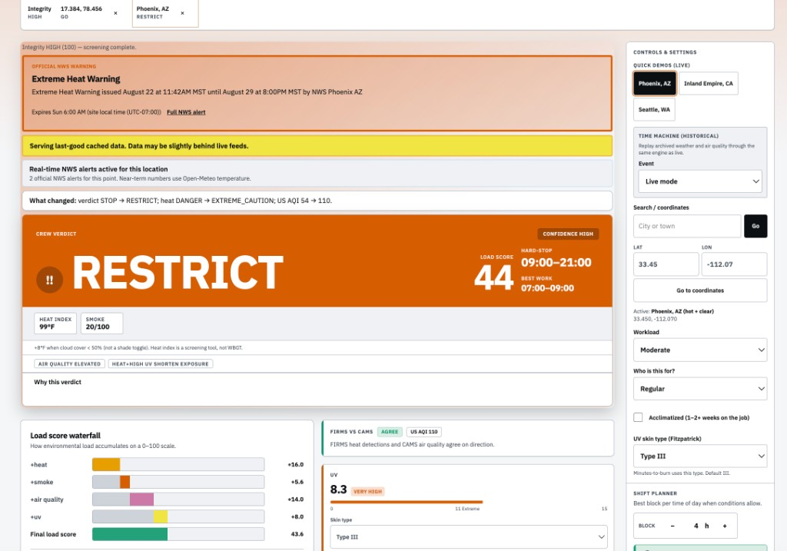
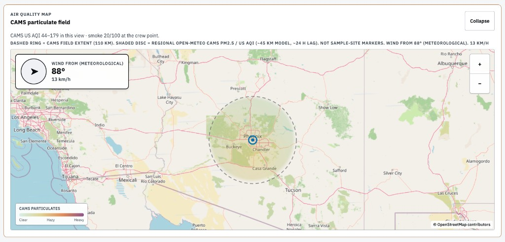
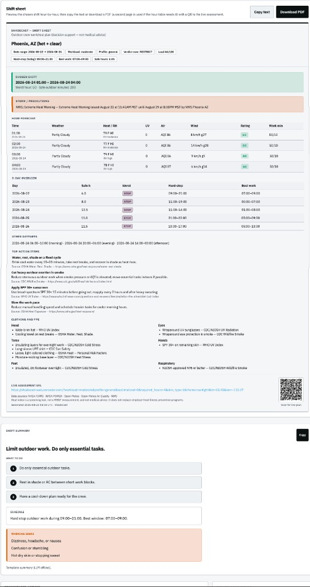
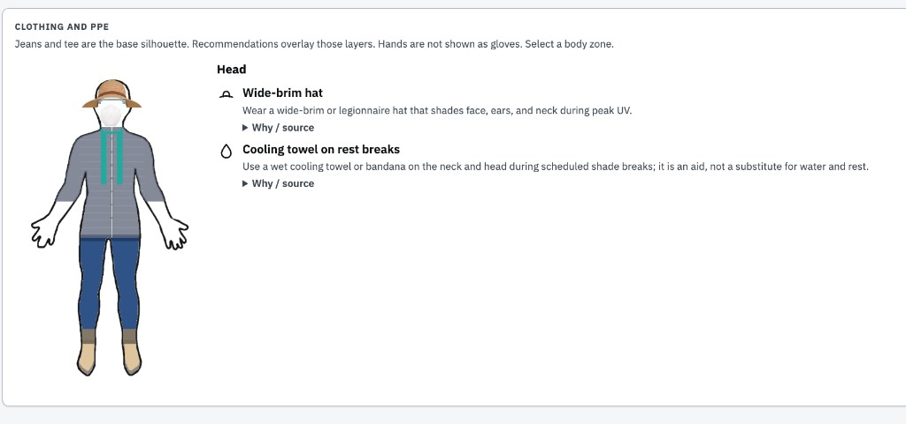
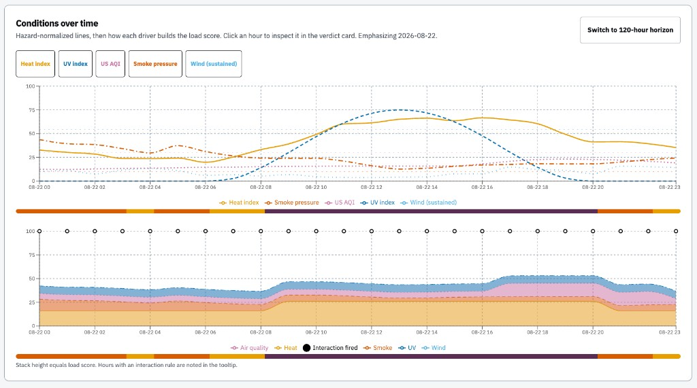
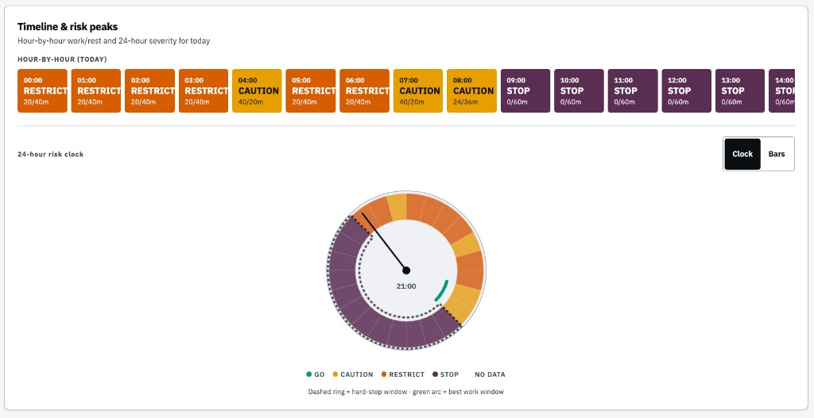

# ShadeCast Devpost / submission notes

A landscaping or roofing supervisor at 6am still opens two apps: OSHA-NIOSH for heat, AirNow for air, then guesses rest minutes. Minnesota Extension tells growers to do exactly that. ShadeCast is the combined work/rest schedule. On the 2026-08-23 Phoenix capture that was RESTRICT, 20 minutes on / 40 in shade, hard-stop 09:00–21:00.

The gap against named tools: the OSHA heat app has no smoke or UV. AirNow has no work/rest minutes and needs a dense US monitor network. Watch Duty is evacuation, not a shift plan. Public health already knows co-exposure is worse. Nobody ships that as GO / CAUTION / RESTRICT / STOP for a named crew, globally, with a refusal when the feeds are garbage.

## What it does

One verdict from heat (Rothfusz, not WBGT), CAMS PM2.5 smoke pressure, UV, US AQI, wind, and US NWS alerts. 5-day planner. Integrity gate. English briefing you copy. Client-side PDF with a QR to the share URL.

Captures from 2026-08-23, live Phoenix (not Time Machine):

*RESTRICT, HI 99°F, smoke 20/100, load 44. NWS Extreme Heat Warning. Cache banner: POWER was stale.*

*OSM + CAMS disc, 110 km ring, wind from 88°.*

*Hard-stop 09:00–21:00. Briefing is the English template (LLM offline).*

What is on screen:

- Time Machine: `?event=` through the same `build_assessment` path.
- Map: OSM + CAMS field (~110 km), not FIRMS fire dots. Historical FIRMS detections, when present, are a labeled list.
- Charts: load-score waterfall, 24h risk clock, 24h/120h condition lines, stacked contribution.
- Storm banner: NWS headline on warnings; Open-Meteo weathercode outside the US, tagged as model.
- Clothing / PPE by body zone. Jeans and tee are the silhouette. Hands are not fake gloves.
- Integrity theater, especially `?corrupt=1`.
- Ops / Sunlight themes.

Email was in an earlier prompt. We did not build Resend. No subscription tables, no outbound mail.

## After user feedback

Testers pushed past the heat-and-smoke core. Themes and what shipped:

| They asked for | We built |
|---|---|
| Real-time weather | NWS live alerts, 0–6 h blend, storm hard-stops |
| Verifiable accuracy | Integrity checklist + confidence (`?corrupt=1`) |
| Medical / crew conditions | Six profiles: general, asthma/respiratory, cardiovascular, children, athlete, over 65 |
| Clothing | Body-zone PPE from `library.yaml` |
| Easy settings | Sidebar + URL-persisted state |
| Shift without download | On-screen shift sheet preview before PDF |
| Shifts for the crew | `ShiftPlanner` with block hours and dayparts |
| Conditions chart | Hourly chart + drivers + risk clock |

## After the v4 prompt

The prompt named NWS, storms, condition charts, clothing/PPE, and email. The first four shipped. Email did not.

NWS is additive. Oaxaca gets Open-Meteo. The status string is `NWS unavailable outside the US — using global model data`. Storm warnings cannot fire there; lightning uses CAPE ≥ 1500 and precip ≥ 50%, or thunder codes.

## How do you know the model is right?

See [docs/validation.md](validation.md). Short version:

1. Unit tables: Rothfusz, WHO UV, EPA AQI, reversed-wind geometry. 212 pytest this tree.
2. Time Machine: Phoenix July 2023 → RESTRICT. Seattle control → GO. Quebec Lebel-sur-Quévillon → RESTRICT (STOP or RESTRICT allowed). NYC June 2023 is **not** a registry event; the sample JSON peaks at US AQI 161.
3. Spearman n=80, ρ=0.54 on CAMS PM2.5-derived smoke vs CAMS `us_aqi`. Consistency inside one model, not EPA monitors.

A synthetic ~0.83 Spearman is a classifier unit test. Say synthetic.

## Questions you might have

**Is smoke pressure AQI?** No. CAMS PM2.5 mapped 0–100. FIRMS is concordance.

**Does the LLM invent risk?** No.

**Where is Time Machine for Canadian wildfires?** Lebel-sur-Quévillon, QC. Archive weather/AQ plus a committed FIRMS CSV so the heat list is not empty. Smoke still comes from CAMS.

**Does NWS break Oaxaca?** No. `InvalidPoint` is cached. Open-Meteo still drives the verdict.

**Spanish briefing?** Fallback templates exist. The UI does not expose a language toggle. Demo in English.

**Live site?** https://shadecast-web.onrender.com/. API and ingest are Render Starter (always on). The UI is static. First load is not a free-tier wake-up.
